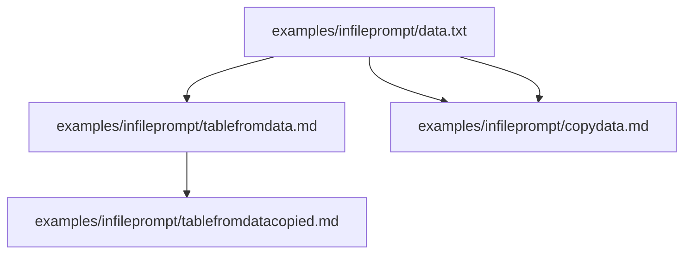

# Infile prompting

This is still somewhat new and experimental, but: how about going declarative instead of using the command line or
[AIGenerationTask](https://aigenpipeline.stoerr.net/aigenpipeline-framework/apidocs/net/stoerr/ai/aigenpipeline/framework/task/AIGenerationTask.html)
to tell the AI what files to process for each task? With infile prompting you can put the prompts right into the file
that contains generated parts. Put a comment like this into the output file:

    <!-- AIGenPromptStart(marker)
    Here comes the prompt for the AI. 
    AIGenCommand(marker)
    inputfile1.txt inputfile2.java
    AIGenPromptEnd(marker) -->
    Here comes the AI output.
    <!-- AIGenEnd(marker) -->

The `marker` should be an unique identifier if you have several prompts in one file. The part between the
`AIGenPromptEnd` and `AIGenEnd` is replaced with the output of the AI when the `aigenpipeline` is run.
In the part between `AIGenCommand` and `AIGenPromptEnd` you can put the command line options for the individual task -
likely mostly the input files. The `AIGenEnd` marker is optional - if it is not present, the line after
the `AIGenPromptEnd` to the end of the file is replaced with the output of the AI.

This is processed with the `-os` / `--outputscan` option, which takes an ant style pattern to find the files to process,
e.g.:

    aigenpipeline -os 'src/site/**/*.md'

In the path, a `*` matches any file name part, and `**` matches any number of directories. Remember to quote the 
pattern if you work with an Unix shell, as the shell would otherwise expand the pattern.

## Printing a dependency diagram

For debugging or getting an overview you can use `-dd` / `--dependencydiagram` to print a diagram of the file
relationships that exist because of the tasks. For example:

    aigenpipeline -os 'examples/infileprompt/*' -dd

prints the following diagram:

## Tell me how it works for you

This is a new experimental idea - please 
[let me know](https://www.stoerr.net/contact.html) how it works for you!
